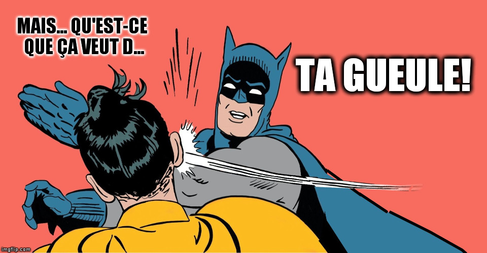

# tgol
Several cell-configurations compete in a Tournament inspired by Conway's Game of Life

## Dear Visitor
If you made it to this point, you are probably interested in how it all works and maybe even how you can hack it.
Let me apologize for the complete lack of documentation. Here are some basics:

### Install and start
Just clone the repository. Run `npm install` to pull dependencies and compile coffeescript code.
Create a directory where the backend service should persiste its tournament data. Do something like 
`export TGOL_HOME=/path/to/that/directory`.
Then run `npm start` to start the service.
ATM the first request is very slow because all the client code is minified on-the-fly.

### Configuration
At the root of the codebase, there is a file `settings.yaml`, which contains defaults for all settings.
To override some of them, put a file `settings.yaml` in your `CGOL_HOME` directory. The content of both files
is merged. 
Within the `CGOL_HOME` directory, there is a subdirectory for each tournament. ATM there will only be `froscon2016` -- the 
name is currently hard-coded in the client code -- we plan to make this configurable eventually.
In the tournament dir, there should be a file `meta.yaml` which contains the PIN for that tournament. A client needs
to provide this PIN when uploading match results.

## Not So Frequently Asked Questions

So, why is it called 'tgol'? 
The 'gol' part is obvious. The 't' is for ['tarent'](http://www.tarent.de), the company we work for.
The was started, because we needed an eye-catcher for tarent's booth at the [FrOSCon 2016](https://www.froscon.de/startseite/).
All coding was done during working hours so we felt it is fair to call the whole thing "tarent's Game of Life".

But my first association was actually this:

